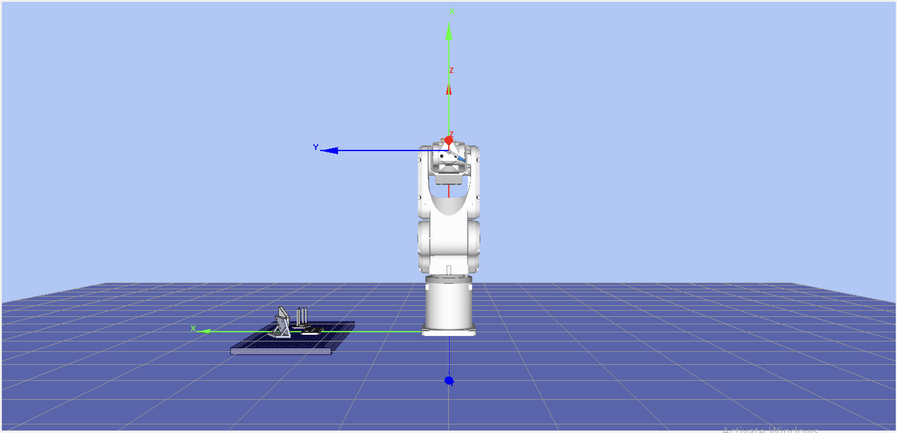
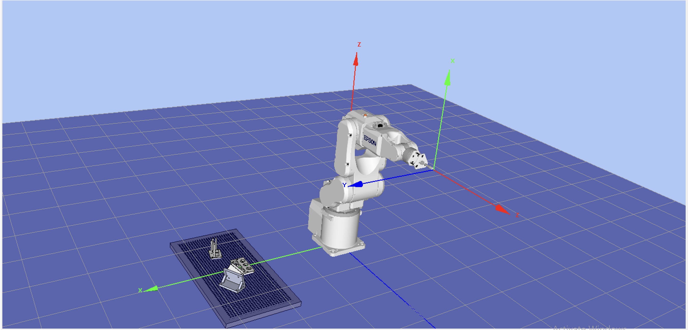
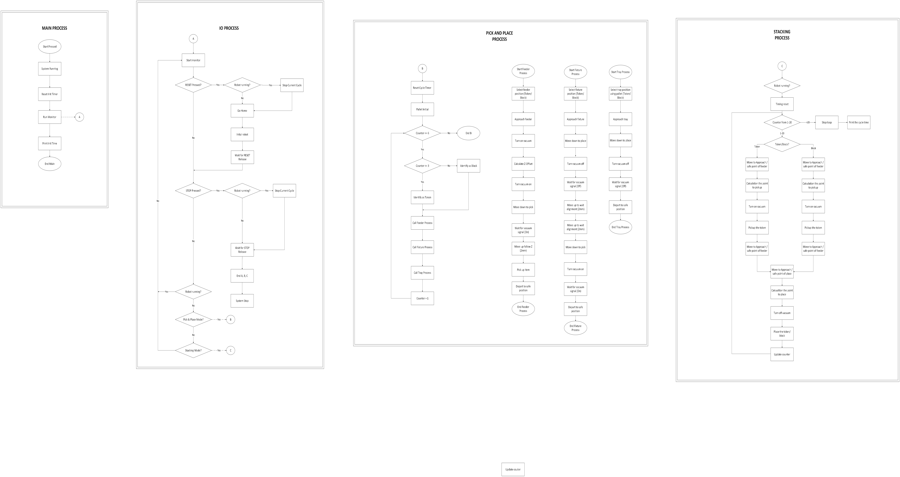

# Epson C3-A600S Pick & Place System

### 👨‍🎓 Project Team & Roles

| Role | Name | Student ID | Responsibilities |
| :--- | :--- | :--- | :--- |
| **Mechanical Engineer (ME)** | **To Nguyen Tan Phuong** | M11451804 | Fixture Design, Tolerance Analysis, 3D Modeling, Jetbot Programming |
| **Electrical Engineer (EE)** | **Nguyen Thao Huong** | M11451806 | I/O Wiring, Electrical Cabinet, Sensor Integration, Stacking Cycle Programming |
| **Robotics Engineer** | **Tran Viet Nam** | M11451805 | Pick and Place Programming, Simulation, Motion Logic |
---

  

  

    
<strong>👁️ Click to view high-resolution static angles (Front & Isometric)</strong>

     
    <table align="center" border="0">
      <tr>
        <td align="center" width="50%">
          
           
          <em>(Front View)</em>
        </td>
        <td align="center" width="50%">
          
           
          <em>(Isometric View)</em>
        </td>
      </tr>
    </table>
  

## 📖 Introduction

This project implements an automated control system for the **Epson C3-A600S (6-Axis)** robot paired with an **RC180 Controller**. The system performs high-speed Pick & Place and Stacking operations between a Feeder, Fixture, and Pallet Tray.

A key highlight of this project is the **Smart Vector-Based Calibration**, which allows operators to re-teach the Tray and Fixture positions using only **2 points** (Origin + Y-Axis) instead of the traditional 3-point method, significantly reducing setup time while ensuring high precision.

## 📂 Repository Structure

* **`images/`**: Contains high-resolution diagrams and screenshots.
* **`Robot_Production.zip`**: Source code for the physical robot (Compatible with **EPSON RC+ 5.0**).
* **`Robot_Simulation.zip`**: Source code for the simulator (Compatible with **EPSON RC+ 7.0**).
* **`Robot_Workflow.vsdx`**: Original Visio file for logic modification.
* **`README.md`**: Project documentation.

---

## ⚙️ Hardware & Software Requirements

### Software Environments
Due to the specific hardware generation, this project operates across two environments:
1.  **Simulation:** Uses **EPSON RC+ 7.0** (For advanced 3D visualization).
2.  **Production:** Uses **EPSON RC+ 5.0** (Required for the physical RC180 controller).

### Hardware Setup
* **Robot:** Epson C3-A600S (6-Axis Vertical Articulated).
* **Controller:** Epson RC180.
* **Peripherals:** Remote I/O Control Box, Vacuum Suction, Vacuum Sensor, Feeder, Fixture, Designed Fixture Standing, Pallet Tray.

### 🔌 Wiring Diagram
Connection diagram between the Remote I/O Box and the RC180 Controller terminals.

  
   
  <em>(Click image to view high-resolution diagram)</em>

---

## 🚀 Key Features

### 1. Smart Auto-Calibration (2-Point Method)
Instead of the standard 3-point wizard, this system uses custom SPEL+ algorithms (`UpdateTrayLocal`, `UpdateFixtureLocal`) to recalculate Local Coordinates:
* **2-Point Teaching:** Requires teaching only the **Origin** and one point on the **Y-Axis**.
* **Auto-Flip Logic:** Automatically detects if the Y-axis was taught in the reverse direction and corrects the orientation by 180°.
* **Math Core:** Utilizes `Atan2` for precise angle calculation while inheriting Z-height and Tilt (V, W) from a master reference Local.

### 2. Motion Optimization
* **Continuous Path (CP):** Extensive use of `Go ... CP` and `Move ... CP` for smooth blending.
* **Parallel Processing:** Vacuum activation occurs *during* movement (`Move ... ! D30; On Vacuum !`).
* **Soft Compliance:** Utilization of `SoftCP` during placement on the Tray.

### 3. Operation Modes
* **Pick & Place Cycle:** Feeder &rarr; Fixture &rarr; Tray.
* **Stacking Cycle:** Vertical stacking of multiple items.

---

## 🔄 Logic Workflow

The system runs a background `Monitor` task for safety and I/O handling, alongside the main `Cycle` task.

  
   
  <em>(Click image to enlarge or <a href="Robot_Workflow.vsdx">download .vsdx source</a>)</em>

---

## 📝 Code Overview

### 1. Calibration Core (`Setup.prg`)
* **`UpdateTrayLocal`**: Recalculates the Tray position.
* **`UpdateFixtureLocal`**: Recalculates the Fixture position with auto-correction.

### 2. Operation Modules
* **`Feeder.prg`**: Picks items with calculated Z-offsets.
* **`Fixture.prg`**: Intermediate alignment station.
* **`Tray.prg`**: Palletizing logic with specific rotation requirements.
* **`Stacking.prg`**: Advanced logic for vertical stacking.

### 3. Task Management (`Main.prg`)
* **`Monitor` Task**: Runs continuously to handle **RESET**, **STOP**, and **START** signals.

---

## 📥 Installation & Usage

### A. Running the Simulation (EPSON RC+ 7.0)
1.  Download and extract **`Robot_Simulation.zip`**.
2.  Import the project into EPSON RC+ 7.0.
3.  Press **F5** and click **Start**.
    * *Note:* `Wait Sw(SensorVacuum)` is disabled in this version for simulation continuity.

### B. Running on Physical Robot (EPSON RC+ 5.0)
1.  Download and extract **`Robot_Production.zip`**.
2.  Import the project into EPSON RC+ 5.0.
3.  **Configure I/O:** Verify `Globals.inc` matches the wiring diagram.
4.  **Calibrate:** Perform the 2-point calibration routine before full-speed operation.
5.  **Build & Download** to the RC180 Controller.

---

## 🛡️ Safety Notes

* **Payload:** Ensure the `Weight` parameter in `Init.prg` matches the actual payload (currently set to `1.5` kg).
* **Speed:** Reduce Speed/Accel to < 10% during the first run.
* **E-Stop:** Always keep the Emergency Stop button within reach.

---
*This project was developed as part of the Autonomous Mobile Vehicles and Robots Introduction (Fall 2025) at National Taiwan University of Science and Technology.*
