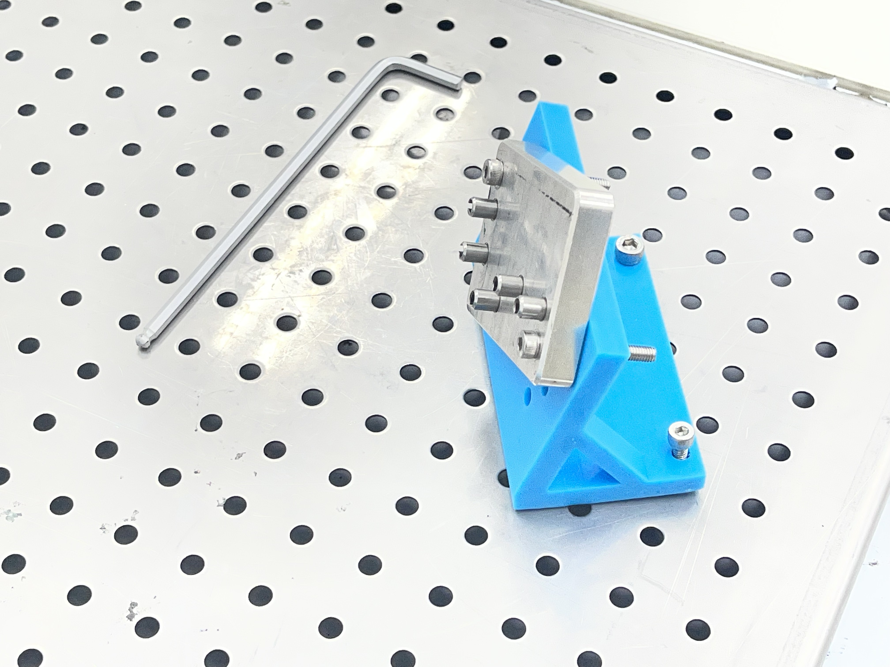
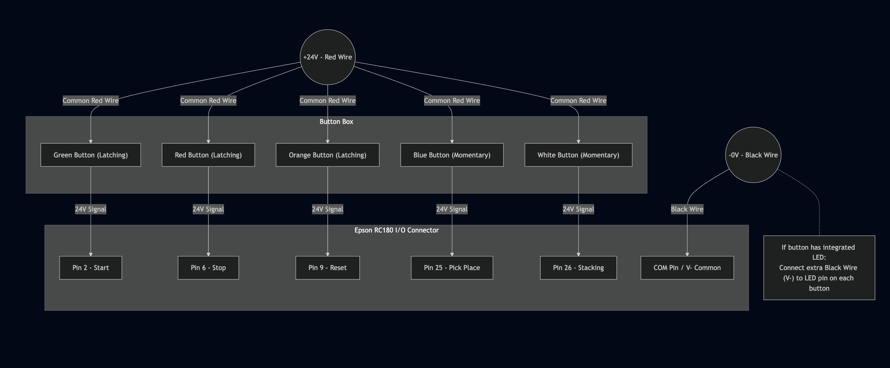

# Epson C3 Robot & JetBot AMR

### 👨‍🎓 Project Team & Roles

| Role | Name | Student ID | Responsibilities |
| :--- | :--- | :--- | :--- |
| **Mechanical Engineer (ME)** | **To Nguyen Tan Phuong** | M11451804 | Fixture Design (STL/CAD), Tolerance Analysis, JetBot AGV Programming & Navigation Logic |
| **Electrical Engineer (EE)** | **Nguyen Thao Huong** | M11451806 | I/O Wiring, Electrical Cabinet, Sensor Integration, Stacking Cycle Programming |
| **Robotics Engineer** | **Tran Viet Nam** | M11451805 | Pick and Place Programming, Simulation, Motion Logic |

---

  

## 📖 Introduction

This repository contains the source code and design resources for a complete **Automated Manufacturing Cell**. The project is divided into two distinct subsystems that work together:

1.  **Mobile Logistics (JetBot AMR):** An Autonomous Mobile Robot responsible for transporting raw materials using vision-based navigation (Line Following & Obstacle Avoidance).
2.  **Assembly Station (Epson Robot):** A 6-Axis Industrial Robotic Arm (Epson C3-A600S) responsible for high-precision Pick & Place and Stacking operations.

## 📂 Repository Structure

The project is organized into two main folders corresponding to the two hardware systems:

### 1. 🏎️ `Jetbot/` (Autonomous Mobile Robot)
Contains the Python-based control logic for the NVIDIA JetBot.
* **`jetbot_main.ipynb`**: The primary control loop. Handles HSV-based Line Following (Yellow) and Dynamic Obstacle Avoidance (Red).
* **`JetBot_config_color.ipynb`**: A GUI tool to calibrate color thresholds for different lighting conditions.
* **`yellow_config.npy`** & **`red_config.npy`**: Configuration files storing the calibrated HSV values.

### 2. 🤖 `Epson/` (Industrial Manipulator)
Contains the SPEL+ code and mechanical designs for the Epson C3 Arm.
* **`Robot_Production.zip`**: Controller source code (compatible with **EPSON RC+ 5.0**).
* **`Robot_Simulation.zip`**: Simulation source code (compatible with **EPSON RC+ 7.0**).
* **`Robot_Workflow.vsdx`**: Logic flowchart.
* **`alignment_fixture.stl`**: 3D printable file for the custom alignment fixture designed to hold parts delivered by the JetBot.

### 3. 🖼️ `images/`
* **`align_design.jpg`**: Real-world photo of the machined alignment fixture.
* **`Wiring_Diagram.png`**, **`Simulation_Demo.gif`**, and other project visuals.

---

## 🚀 Key Features

### Part I: JetBot AMR (Logistics)
The mobile robot uses a camera-based vision system to navigate the factory floor:
* **Vision-Based Navigation:** Follows a yellow path using PID control on HSV-filtered images.
* **Smart Obstacle Avoidance:** Detects red obstacles. Upon detection, it executes a blind-run maneuver to bypass the object and uses a "Far Detection" algorithm to search for the line and merge back into the lane.
* **Fast Calibration:** Includes a Jupyter Notebook tool for quick color threshold adjustments.

### Part II: Epson Robot (Assembly)
The industrial arm handles the manipulation of objects delivered by the AMR:
* **Smart Auto-Calibration (2-Point):** Uses custom algorithms (`UpdateTrayLocal`, `UpdateFixtureLocal`) to teach work planes using only 2 points (Origin + Y-Axis), automatically correcting for orientation flip.
* **Motion Optimization:** Utilizes Continuous Path (`CP`) blending and parallel processing (vacuum activation during motion) for minimum cycle time.

---

## ⚙️ Hardware & Software

| System | Hardware | Software / Language |
| :--- | :--- | :--- |
| **Mobile Robot** | NVIDIA JetBot (Waveshare/SparkFun) | Python 3.6+, Jupyter Lab |
| **Industrial Arm** | Epson C3-A600S (6-Axis) + RC180 Controller | EPSON RC+ 5.0 (SPEL+) |
| **Simulation** | PC | EPSON RC+ 7.0 |

### Mechanical Design: Alignment Fixture
A custom fixture was designed and machined to bridge the two systems, ensuring the JetBot delivers parts to a precise location for the arm to pick up.

  
   
  <em>(Actual machined fixture - STL file available in <code>Epson/alignment_fixture.stl</code>)</em>

---

## 📥 Installation & Usage

### Setting up the JetBot
1.  Connect to the JetBot via Wi-Fi and open Jupyter Lab.
2.  Upload the contents of the `Jetbot/` folder.
3.  Run `JetBot_config_color.ipynb` to calibrate the Yellow (Line) and Red (Obstacle) colors.
4.  Execute `jetbot_main.ipynb` to start the autonomous operation.

### Setting up the Epson Robot
1.  **For Simulation:** Unzip `Epson/Robot_Simulation.zip` and open project in EPSON RC+ 7.0.
2.  **For Production:** Unzip `Epson/Robot_Production.zip`, import into EPSON RC+ 5.0, and upload to the RC180 controller.
3.  **Wiring:** Refer to the wiring diagram below for I/O connections.

  

    
<strong>🔌 Click to view Wiring Diagram</strong>

    
  

---
*This project was developed as part of the Autonomous Mobile Vehicles and Robots Introduction (Fall 2025) at National Taiwan University of Science and Technology.*
