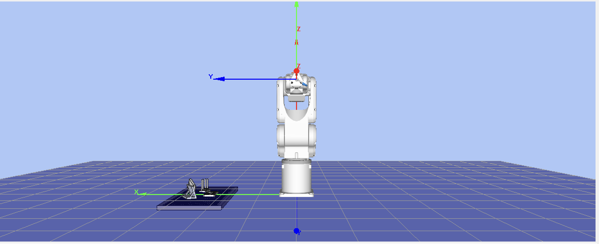

# Epson C3-A600S Pick & Place System

  

## 📖 Introduction

This project implements an automated control system for the **Epson C3-A600S (6-Axis)** robot paired with an **RC180 Controller**. The system performs high-speed Pick & Place and Stacking operations between a Feeder, Fixture, and Pallet Tray.

A key highlight of this project is the **Smart Vector-Based Calibration**, which allows operators to re-teach the Tray and Fixture positions using only **2 points** (Origin + Y-Axis) instead of the traditional 3-point method, significantly reducing setup time while ensuring high precision.

## 📂 Repository Structure

* **`images/`**: Contains diagrams, flowcharts, and simulation screenshots.
* **`Robot_Production.zip`**: Source code for the physical robot (Compatible with **EPSON RC+ 5.0**).
* **`Robot_Simulation.zip`**: Source code for the simulator (Compatible with **EPSON RC+ 7.0**).
* **`README.md`**: Project documentation.

---

## ⚙️ Hardware & Software Requirements

Due to the specific hardware generation (C3 robot + RC180 controller), this project operates across two software environments:

### Software Environments
1.  **Simulation Environment:** Uses **EPSON RC+ 7.0**.
    * *Reason:* RC+ 7.0 offers superior 3D simulation capabilities for testing logic and motion paths.
2.  **Production Environment:** Uses **EPSON RC+ 5.0**.
    * *Reason:* The physical RC180 controller requires RC+ 5.0 for connection and program execution.

### Hardware Setup
* **Robot:** Epson C3-A600S (6-Axis Vertical Articulated).
* **Controller:** Epson RC180.
* **Peripherals:**
    * Remote I/O Control Box (Start, Stop, Reset).
    * Vacuum Gripper with pressure sensors.
    * Workstations: Feeder, Alignment Fixture, Pallet Tray.

### 🔌 Wiring Diagram
Connection diagram between the Remote I/O Box and the RC180 Controller terminals:

  

---

## 🚀 Key Features

### 1. Smart Auto-Calibration (2-Point Method)
Instead of the standard 3-point wizard, this system uses custom SPEL+ algorithms (`UpdateTrayLocal`, `UpdateFixtureLocal`) to recalculate Local Coordinates:
* **2-Point Teaching:** Requires teaching only the **Origin** and one point on the **Y-Axis**.
* **Auto-Flip Logic:** Automatically detects if the Y-axis was taught in the reverse direction and corrects the orientation by 180°.
* **Math Core:** Utilizes `Atan2` for precise angle calculation while inheriting Z-height and Tilt (V, W) from a master reference Local.

### 2. Motion Optimization
* **Continuous Path (CP):** Extensive use of `Go ... CP` and `Move ... CP` for smooth blending between motion segments.
* **Parallel Processing:** Vacuum activation occurs *during* the vertical descent (`Move ... ! D30; On Vacuum !`) to minimize cycle time.
* **Soft Compliance:** Utilization of `SoftCP` during placement on the Tray to compensate for minor mechanical misalignments.

### 3. Operation Modes
The system supports two distinct cycles, selectable via I/O:
* **Pick & Place Cycle:** Feeder &rarr; Fixture &rarr; Tray.
* **Stacking Cycle:** Vertical stacking of multiple items.

---

## 🔄 Logic Workflow

The system runs a background `Monitor` task for safety and I/O handling, alongside the main `Cycle` task for robot motion.

  

---

## 📝 Code Overview

### 1. Calibration Core (`Setup.prg`)
Contains the mathematical logic for updating Locals 2 and 3.
* **`UpdateTrayLocal`**: Recalculates the Tray position.
* **`UpdateFixtureLocal`**: Recalculates the Fixture position with auto-correction for reverse teaching.

### 2. Operation Modules
* **`Feeder.prg`**: Picks items with calculated Z-offsets. Uses `(itemIndex - 1) Mod 3` for matrix handling.
* **`Fixture.prg`**: Intermediate station for item alignment.
* **`Tray.prg`**: Palletizing logic. Defines separate Pallets for "Tokens" and "Blocks" to handle specific rotation requirements.
* **`Stacking.prg`**: Advanced logic for vertical stacking.

### 3. Task Management (`Main.prg`)
* **`Monitor` Task**: Runs continuously (`NoPause`) to handle:
    * **RESET (Input 7):** Aborts tasks, homes the robot, and resets parameters.
    * **STOP (Input 4):** Safely stops the cycle after the current operation.
    * **START:** Triggers the selected operational cycle.

---

## 📥 Installation & Usage

Please select the appropriate guide based on your environment.

### A. Running the Simulation
* **Target:** Testing logic and visualizing 3D motion.
* **Software:** **EPSON RC+ 7.0**.

1.  Download and extract **`Robot_Simulation.zip`**.
2.  Open **EPSON RC+ 7.0**.
3.  Go to **Project** &rarr; **Import** and select the extracted folder.
4.  Press **F5** to open the Run Window and click **Start**.
    * *Note:* In this version, the command `Wait Sw(SensorVacuum)` is commented out to prevent the program from hanging due to the lack of physical sensors.

### B. Running on Physical Robot (Production)
* **Target:** Real-world operation with the C3-A600S.
* **Software:** **EPSON RC+ 5.0**.

1.  Download and extract **`Robot_Production.zip`**.
2.  Open **EPSON RC+ 5.0**.
3.  Create a new project or Import the source files.
4.  **I/O Configuration:** Ensure `Globals.inc` matches your physical wiring.
5.  **Tool Configuration:** Accurately define Tool 1 (or Tool 2) dimensions for the suction cup.
6.  **Build & Download** to the RC180 Controller.
7.  **Calibration:** Perform the 2-point calibration routine before running the auto cycle.

---

## 🛡️ Safety Notes

* **Payload:** Ensure the `Weight` parameter in `Init.prg` matches the actual payload (currently set to `1.5` kg).
* **Speed:** When running the Calibration or Cycle for the first time, reduce the Speed/Accel to < 10%.
* **Emergency Stop:** Always verify the E-Stop functionality before operation.

---
*Author: [Your Name]*
